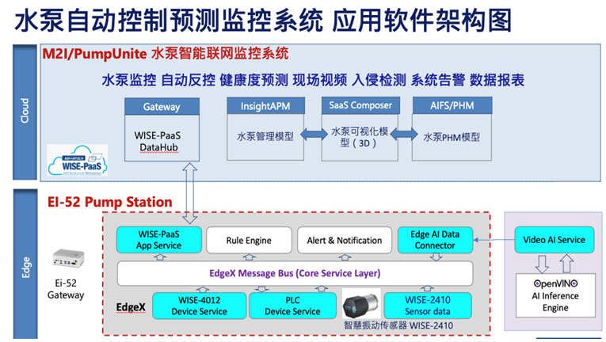

# 2021 Edgex China Challenge Project
## The Software Architecture

## Edge Software Component List
<table>
    <thead>
        <tr>
            <th style="width:100%">Docker Image Name</th>
            <th style="width:100%">Remark</th>
        </tr>
    </thead>
    <tbody>
        <tr>
            <td>video-analytics-serving-gstreamer</td>
            <td>Intel OpenVINO DL streamer package</td>
        </tr>
        <tr>
            <td>openvino_jsmpeg</td>
            <td>Convert OpenVINO streaming to HTTP protocol</td>
        </tr> 
        <tr>
            <td>docker-support-notifications-go</td>
            <td>Add HTML tag type for Email</td>
        </tr>
        <tr>
            <td>docker-app-functions-wise</td>
            <td rowspan=6>Created by Advantech</td>
        </tr>
        <tr>
            <td>docker-app-functions-influx</td>
        </tr> 
        <tr>
            <td>docker-app-functions-aws</td>
        </tr>
        <tr>
            <td>docker-app-functions-alibaba</td>
        </tr>
        <tr>
            <td>docker-app-functions-azure</td>
        </tr>
        <tr>
            <td>edgex-wrapper</td>
        </tr>
        <tr>
            <td>docker-edgex-ui-go</td>
            <td>Modify for rule engine with eKuiper v1.1</td>
        </tr>  
        <tr>
            <td>docker-device-modbus-go</td>
            <td>Modify with hardware configuration</td>
        </tr>
        <tr>
            <td>docker-support-scheduler-go</td>
            <td rowspan=14>Provided from EdgeX Foundry, FUJI version</td>
        </tr>
        <tr>
            <td>docker-sys-mgmt-agent-go</td>
        </tr> 
        <tr>
            <td>docker-support-logging-go</td>
        </tr>
        <tr>
            <td>docker-core-command-go</td>
        </tr>
        <tr>
            <td>docker-core-metadata-go</td>
        </tr>
        <tr>
            <td>docker-core-data-go</td>
        </tr>
        <tr>
            <td>docker-core-config-seed-go</td>
        </tr>
        <tr>
            <td>docker-device-rest-go</td>
        </tr>
         <tr>
            <td>docker-app-service-configurable</td>
        </tr>
        <tr>
            <td>docker-device-random-go</td>
        </tr>
        <tr>
            <td>consul</td>
        </tr> 
        <tr>
            <td>docker-edgex-mongo</td>
        </tr>
        <tr>
            <td>docker-edgex-volume</td>
        </tr> 
        <tr>
            <td>portainer</td>
        </tr> 
        <tr>
            <td>kuiper</td>
            <td>Porting from eKuiper v1.1</td>
        </tr>
        <tr>
            <td>eclipse-mosquitto</td>
            <td>MQTT broker</td>
        </tr>     
    </tbody>
</table>

## Before the installation
Before the installation, meet the following prerequisites.
1.	Prepare the machine: Advantech EI-52 with Ubuntu Linux 20.04 LTS preinstalled.
2.	A USB webcam that the resolution limit is 720p.
## Clone source code of the video-inference project
 ```bash
 sudo git clone https://github.com/Advantech-Edgex/video-analytics-serving.git -b feature-webcam video-inference
 ```
## Install required software
To install the required software. E.g. Docker, curl, mosquitto-clients…, which will take some time.
 ```bash
make install
```
## Deploy
Before the deployment, we may modify the Modbus device service according to physical hardware configuration.
* ./modbus/configuration.toml
* ./modbus/WISE-4012.yaml
* ./modbus/FATEKPLC.yaml

To deploy that will be finished tasks:
* Start all Edge microservice that including EdgeX, video AI service, SMTP server...
* Setup the rule engine.
* Setup the alert & notification.
* Setup the WISE-PaaS APP service.
* Setup the video AI service.
 ```bash
make deploy
```
